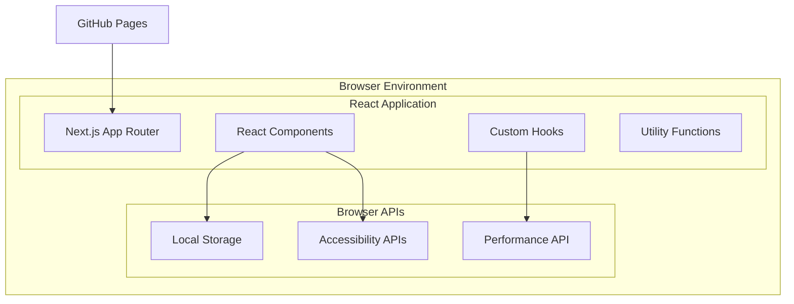
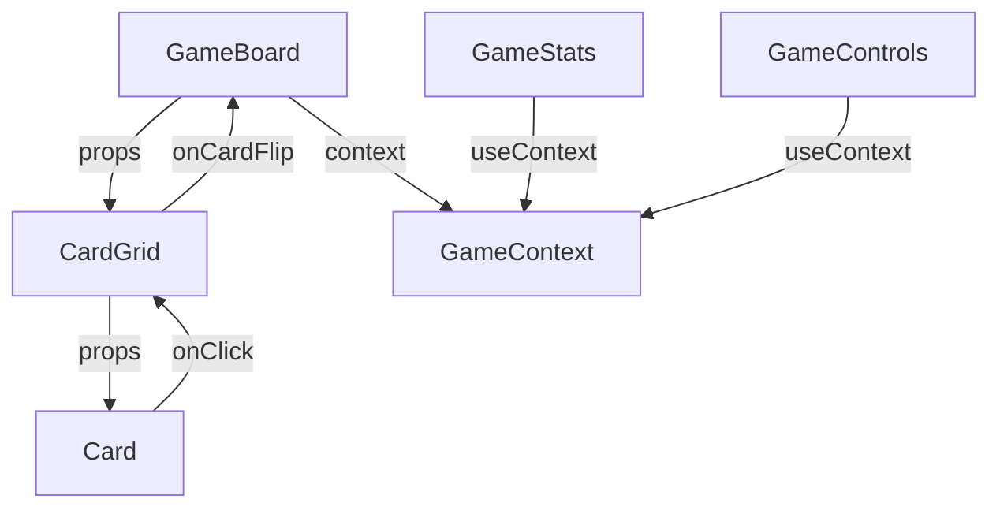
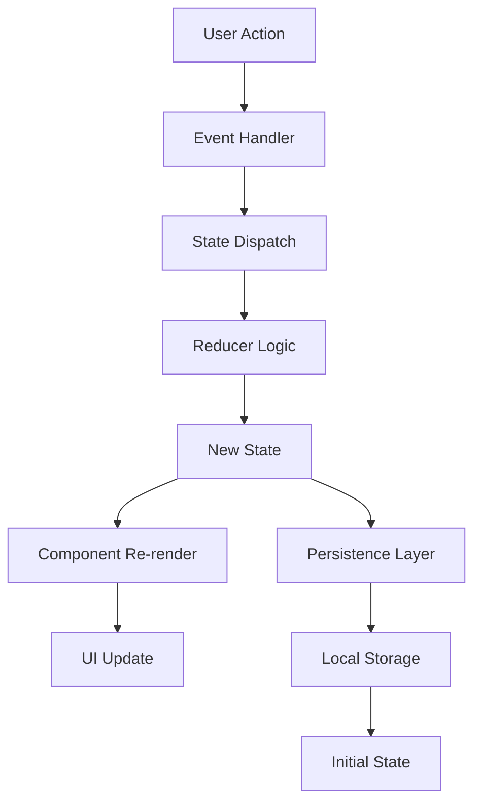
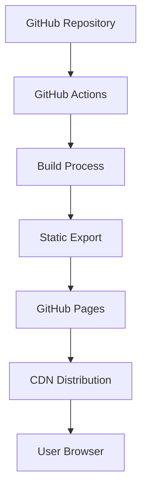

# 🏗 Emoji Memory Game - Architecture Documentation

This document provides a comprehensive overview of the system architecture, design decisions, and technical implementation of the Emoji Memory Game.

## 📋 Table of Contents

- [System Overview](#system-overview)
- [Technology Stack](#technology-stack)
- [Architecture Patterns](#architecture-patterns)
- [Component Architecture](#component-architecture)
- [State Management](#state-management)
- [Data Flow](#data-flow)
- [Performance Considerations](#performance-considerations)
- [Security Architecture](#security-architecture)
- [Deployment Architecture](#deployment-architecture)

## 🌐 System Overview

### Application Type
**Client-Side Single Page Application (SPA)**
- No backend server required
- All logic runs in the browser
- Static file deployment to GitHub Pages
- Offline-capable after initial load

### Core Architecture Principles

1. **Component-Based Design**: Modular, reusable React components
2. **Unidirectional Data Flow**: Predictable state management patterns
3. **Performance First**: Optimized for Core Web Vitals
4. **Accessibility First**: WCAG 2.1 AA compliance built-in
5. **Progressive Enhancement**: Works without JavaScript (basic functionality)
6. **Mobile First**: Responsive design starting from mobile devices

### System Boundaries



## 🛠 Technology Stack

### Core Technologies
```typescript
interface TechnologyStack {
  // Frontend Framework
  framework: 'Next.js 15.4.3';
  runtime: 'React 19.1.0';
  language: 'TypeScript 5+';
  
  // Styling & UI
  styling: 'Tailwind CSS 4';
  animations: 'CSS Transforms + Transitions';
  
  // Build & Development
  bundler: 'Turbopack' | 'Webpack 5';
  linting: 'ESLint + TypeScript ESLint';
  formatting: 'Prettier';
  hooks: 'Husky';
  
  // Testing
  testing: 'Jest + React Testing Library';
  e2e: 'Playwright' | 'Cypress';
  
  // Deployment
  hosting: 'GitHub Pages';
  ci: 'GitHub Actions';
}
```

### Technology Rationale

#### Next.js 15
**Why chosen:**
- **App Router**: Modern routing with layouts and nested routes
- **Static Export**: Perfect for GitHub Pages deployment
- **Performance**: Built-in optimizations (code splitting, image optimization)
- **TypeScript**: First-class TypeScript support
- **Developer Experience**: Hot reloading, error overlay, debugging tools

#### React 19
**Why chosen:**
- **Modern Hooks**: Latest hook patterns and optimizations
- **Concurrent Features**: Better performance with concurrent rendering
- **Server Components**: Future-proofing (though not used in static export)
- **Strict Mode**: Better development experience and bug detection

#### Tailwind CSS 4
**Why chosen:**
- **Utility-First**: Rapid UI development
- **Performance**: Automatic purging of unused styles
- **Responsive Design**: Built-in responsive utilities
- **Customization**: Easy theming and customization
- **Modern Features**: Container queries, color functions

## 🏛 Architecture Patterns

### 1. Component Architecture Pattern

```typescript
// Component Hierarchy
interface ComponentArchitecture {
  'Layout Components': {
    'app/layout.tsx': 'Root layout with global providers';
    'app/page.tsx': 'Home page container';
  };
  
  'Game Components': {
    'GameBoard.tsx': 'Main game orchestrator';
    'Card.tsx': 'Individual memory card';
    'GameControls.tsx': 'Game control buttons';
    'GameStats.tsx': 'Statistics display';
  };
  
  'UI Components': {
    'Modal.tsx': 'Reusable modal dialog';
    'Button.tsx': 'Consistent button styling';
    'Select.tsx': 'Custom select component';
  };
}
```

### 2. Custom Hooks Pattern

```typescript
// Hook Responsibilities
interface HookArchitecture {
  'State Management': {
    'useGameState': 'Primary game state management';
    'useTimer': 'Game timer functionality';
    'useLocalStorage': 'Persistent data management';
  };
  
  'UI Interaction': {
    'useCardFlip': 'Card flip animations';
    'useKeyboardNavigation': 'Keyboard controls';
    'useTouch': 'Touch gesture handling';
  };
  
  'Performance': {
    'useDebounce': 'Debounced operations';
    'useMemoizedSelector': 'Optimized state selection';
    'useVirtualization': 'Large board optimization';
  };
}
```

### 3. Utility Function Pattern

```typescript
// Pure Functions Organization
interface UtilityArchitecture {
  'Game Logic': {
    'gameLogic.ts': 'Core game algorithms';
    'scoring.ts': 'Score calculation logic';
    'validation.ts': 'Input validation';
  };
  
  'Data Management': {
    'emojiData.ts': 'Emoji collections and filtering';
    'storage.ts': 'Local storage operations';
    'migration.ts': 'Data migration utilities';
  };
  
  'Performance': {
    'optimization.ts': 'Performance utilities';
    'debounce.ts': 'Debouncing and throttling';
    'memoization.ts': 'Memoization helpers';
  };
}
```

## 🧩 Component Architecture

### Component Hierarchy

```
App (Layout)
├── GameBoard (Container)
│   ├── GameHeader
│   │   ├── GameTitle
│   │   ├── GameStats (Timer, Moves, Score)
│   │   └── GameControls (Pause, Reset, Settings)
│   ├── DifficultySelector
│   ├── CategorySelector
│   ├── CardGrid
│   │   └── Card[] (Multiple instances)
│   └── GameOverModal
└── Footer
```

### Component Responsibilities

#### Container Components
```typescript
// GameBoard.tsx - Main game orchestrator
export default function GameBoard() {
  const { gameState, dispatch } = useGameState();
  const { time, startTimer, pauseTimer } = useTimer();
  const { saveScore } = useLocalStorage();
  
  // Coordinates all game functionality
  // Manages game lifecycle
  // Handles high-level state changes
}
```

#### Presentation Components
```typescript
// Card.tsx - Pure UI component
interface CardProps {
  emoji: string;
  isFlipped: boolean;
  isMatched: boolean;
  onClick: () => void;
  disabled: boolean;
}

const Card = React.memo(({ emoji, isFlipped, isMatched, onClick, disabled }: CardProps) => {
  // Pure presentation logic
  // Optimized with React.memo
  // Handles only UI concerns
});
```

#### Hook Components
```typescript
// Custom hooks encapsulate business logic
export function useGameState() {
  const [state, dispatch] = useReducer(gameReducer, initialState);
  
  // Business logic methods
  const flipCard = useCallback((cardId: number) => {
    dispatch({ type: 'FLIP_CARD', payload: cardId });
  }, []);
  
  return { state, flipCard, /* ... */ };
}
```

### Component Communication Patterns

1. **Props Down**: Data flows down through props
2. **Events Up**: Events bubble up through callback props
3. **Context**: Shared state through React Context
4. **Custom Hooks**: Shared logic through hooks



## 🔄 State Management

### State Architecture

```typescript
// Global Game State
interface GameState {
  // Game Configuration
  difficulty: 'easy' | 'medium' | 'hard' | 'expert';
  category: EmojiCategory;
  boardSize: { rows: number; cols: number };
  
  // Game Data
  cards: Card[];
  flippedCards: number[];
  matchedPairs: Set<number>;
  
  // Game Progress
  moves: number;
  timeElapsed: number;
  score: number;
  gameStatus: 'setup' | 'playing' | 'paused' | 'completed';
  
  // UI State
  showSettings: boolean;
  showStats: boolean;
  showHelp: boolean;
}
```

### State Management Strategy

#### 1. useReducer for Complex State
```typescript
// Game state reducer pattern
function gameReducer(state: GameState, action: GameAction): GameState {
  switch (action.type) {
    case 'FLIP_CARD':
      return handleCardFlip(state, action.payload);
    case 'MATCH_CARDS':
      return handleCardMatch(state, action.payload);
    case 'RESET_GAME':
      return createInitialState(state.difficulty, state.category);
    default:
      return state;
  }
}
```

#### 2. Context for Global State
```typescript
// Game context for shared state
const GameContext = createContext<GameContextValue | null>(null);

export function GameProvider({ children }: { children: ReactNode }) {
  const [gameState, dispatch] = useReducer(gameReducer, initialState);
  const { time, startTimer, pauseTimer, resetTimer } = useTimer();
  
  const value = useMemo(() => ({
    gameState,
    dispatch,
    time,
    startTimer,
    pauseTimer,
    resetTimer,
  }), [gameState, time]);
  
  return <GameContext.Provider value={value}>{children}</GameContext.Provider>;
}
```

#### 3. Local Component State
```typescript
// Component-specific state
export function Card({ id, emoji, onClick }: CardProps) {
  // Animation state (local to component)
  const [isAnimating, setIsAnimating] = useState(false);
  
  // Temporary UI state (doesn't need global management)
  const [isHovered, setIsHovered] = useState(false);
}
```

### State Persistence

```typescript
// Local storage strategy
interface PersistedState {
  highScores: Record<Difficulty, Score[]>;
  gameSettings: GameSettings;
  statistics: GameStatistics;
  preferences: UserPreferences;
}

export function useLocalStorage<T>(key: string, defaultValue: T) {
  const [value, setValue] = useState<T>(() => {
    try {
      const item = localStorage.getItem(key);
      return item ? JSON.parse(item) : defaultValue;
    } catch {
      return defaultValue;
    }
  });
  
  const setStoredValue = useCallback((newValue: T) => {
    setValue(newValue);
    localStorage.setItem(key, JSON.stringify(newValue));
  }, [key]);
  
  return [value, setStoredValue] as const;
}
```

## 🌊 Data Flow

### Data Flow Architecture



### Detailed Data Flow Scenarios

#### 1. Card Flip Flow
```typescript
// 1. User clicks card
onClick={() => handleCardClick(cardId)}

// 2. Event handler processes click
const handleCardClick = (cardId: number) => {
  if (canFlipCard(gameState, cardId)) {
    dispatch({ type: 'FLIP_CARD', payload: cardId });
  }
};

// 3. Reducer updates state
case 'FLIP_CARD':
  const newFlippedCards = [...state.flippedCards, action.payload];
  
  if (newFlippedCards.length === 2) {
    return checkForMatch(state, newFlippedCards);
  }
  
  return { ...state, flippedCards: newFlippedCards, moves: state.moves + 1 };

// 4. Components re-render with new state
// 5. UI updates to show flipped card
```

#### 2. Game Completion Flow
```typescript
// 1. Last pair matched triggers completion check
const checkGameCompletion = (state: GameState): GameState => {
  const allMatched = state.cards.every(card => card.isMatched);
  
  if (allMatched) {
    const finalScore = calculateScore(state);
    
    // Update high scores
    saveHighScore(finalScore);
    
    return {
      ...state,
      gameStatus: 'completed',
      score: finalScore,
    };
  }
  
  return state;
};
```

### Performance Optimizations in Data Flow

1. **Memoization**: Prevent unnecessary re-renders
2. **Batching**: Group related state updates
3. **Selective Updates**: Update only changed components
4. **Lazy Loading**: Load components on demand

```typescript
// Memoized selectors
const selectVisibleCards = useMemo(() => {
  return gameState.cards.filter(card => !card.isMatched);
}, [gameState.cards]);

// Batched updates
const handleMultipleActions = () => {
  startTransition(() => {
    dispatch({ type: 'ACTION_1' });
    dispatch({ type: 'ACTION_2' });
    dispatch({ type: 'ACTION_3' });
  });
};
```

## ⚡ Performance Considerations

### Core Web Vitals Optimization

#### Largest Contentful Paint (LCP) < 2.5s
```typescript
// Optimize initial render
const GameBoard = dynamic(() => import('./GameBoard'), {
  loading: () => <GameBoardSkeleton />,
});

// Preload critical resources
<Head>
  <link rel="preload" href="/fonts/inter.woff2" as="font" type="font/woff2" crossOrigin="" />
</Head>
```

#### First Input Delay (FID) < 100ms
```typescript
// Optimize event handlers
const handleCardClick = useCallback((cardId: number) => {
  // Use scheduler to defer non-urgent updates
  startTransition(() => {
    dispatch({ type: 'FLIP_CARD', payload: cardId });
  });
}, []);

// Break up long tasks
const processLargeBoard = (cards: Card[]) => {
  return new Promise(resolve => {
    const process = (index = 0) => {
      const batch = cards.slice(index, index + 10);
      processBatch(batch);
      
      if (index + 10 < cards.length) {
        setTimeout(() => process(index + 10), 0);
      } else {
        resolve(cards);
      }
    };
    process();
  });
};
```

#### Cumulative Layout Shift (CLS) < 0.1
```typescript
// Consistent dimensions
.card {
  @apply aspect-square; /* Maintain aspect ratio */
  width: 100%;
  height: auto;
}

// Skeleton loading
const CardSkeleton = () => (
  <div className="aspect-square bg-gray-200 rounded-lg animate-pulse" />
);
```

### Memory Management

```typescript
// Cleanup effects
useEffect(() => {
  const timer = setInterval(updateTimer, 1000);
  
  return () => {
    clearInterval(timer);
  };
}, []);

// Optimize large lists
const VirtualizedCardGrid = () => {
  const { visibleCards, scrollHandler } = useVirtualization({
    items: cards,
    itemHeight: 120,
    containerHeight: 600,
  });
  
  return (
    <div onScroll={scrollHandler}>
      {visibleCards.map(card => <Card key={card.id} {...card} />)}
    </div>
  );
};
```

## 🔒 Security Architecture

### Client-Side Security

#### Content Security Policy
```typescript
// next.config.ts
const securityHeaders = [
  {
    key: 'Content-Security-Policy',
    value: "default-src 'self'; script-src 'self' 'unsafe-eval'; style-src 'self' 'unsafe-inline';"
  },
  {
    key: 'X-Frame-Options',
    value: 'DENY'
  },
  {
    key: 'X-Content-Type-Options',
    value: 'nosniff'
  }
];
```

#### Data Validation
```typescript
// Input validation
const validateGameSettings = (settings: unknown): GameSettings => {
  const schema = z.object({
    difficulty: z.enum(['easy', 'medium', 'hard', 'expert']),
    category: z.string().min(1),
    soundEnabled: z.boolean(),
  });
  
  return schema.parse(settings);
};

// Sanitize user data
const sanitizeStorageData = (data: string): unknown => {
  try {
    const parsed = JSON.parse(data);
    return validateStorageStructure(parsed);
  } catch {
    return null;
  }
};
```

#### Local Storage Security
```typescript
// Secure storage operations
const STORAGE_KEYS = {
  HIGH_SCORES: 'emoji-memory-high-scores',
  SETTINGS: 'emoji-memory-settings',
  STATISTICS: 'emoji-memory-stats',
} as const;

const secureStorage = {
  get<T>(key: string): T | null {
    try {
      const item = localStorage.getItem(key);
      if (!item) return null;
      
      const parsed = JSON.parse(item);
      return validateStorageData(parsed);
    } catch {
      return null;
    }
  },
  
  set<T>(key: string, value: T): void {
    try {
      const validated = validateStorageData(value);
      localStorage.setItem(key, JSON.stringify(validated));
    } catch (error) {
      console.warn('Failed to save to localStorage:', error);
    }
  }
};
```

### Privacy Considerations

1. **No External Analytics**: No tracking or data collection
2. **Local Data Only**: All data stored locally
3. **No Cookies**: Cookie-free implementation
4. **Minimal Permissions**: No unnecessary browser APIs

```typescript
// Privacy-compliant implementation
const privacyCompliantGameLogic = {
  // No user identification
  // No external data transmission
  // No behavioral tracking
  // No personal data collection
};
```

## 🚀 Deployment Architecture

### Static Site Architecture



### Build Process

```yaml
# .github/workflows/deploy.yml
name: Build and Deploy
on:
  push:
    branches: [ main ]

jobs:
  build-and-deploy:
    runs-on: ubuntu-latest
    steps:
      - name: Checkout
        uses: actions/checkout@v4
        
      - name: Setup Node.js
        uses: actions/setup-node@v4
        with:
          node-version: '18'
          cache: 'npm'
          
      - name: Install dependencies
        run: npm ci
        
      - name: Type check
        run: npm run type-check
        
      - name: Lint
        run: npm run lint
        
      - name: Test
        run: npm run test
        
      - name: Build
        run: npm run build
        
      - name: Export
        run: npm run export
        
      - name: Deploy to Pages
        uses: peaceiris/actions-gh-pages@v3
        with:
          github_token: ${{ secrets.GITHUB_TOKEN }}
          publish_dir: ./out
```

### Production Optimizations

```typescript
// next.config.ts
const nextConfig = {
  // Static export for GitHub Pages
  output: 'export',
  trailingSlash: true,
  
  // Asset optimization
  images: {
    unoptimized: true, // Required for static export
  },
  
  // Path configuration for GitHub Pages
  assetPrefix: process.env.NODE_ENV === 'production' ? '/sa-memory-game/' : '',
  basePath: process.env.NODE_ENV === 'production' ? '/sa-memory-game' : '',
  
  // Performance optimizations
  compress: true,
  poweredByHeader: false,
  
  // Webpack optimizations
  webpack: (config) => {
    config.optimization.splitChunks = {
      cacheGroups: {
        vendor: {
          test: /[\\/]node_modules[\\/]/,
          name: 'vendors',
          chunks: 'all',
        },
      },
    };
    return config;
  },
};
```

### Content Delivery

1. **Static Assets**: Served directly from GitHub Pages
2. **Bundle Splitting**: Separate vendor and app bundles
3. **Caching Strategy**: Leverage browser caching for static assets
4. **Compression**: Gzip compression for text assets

## 📊 Monitoring and Analytics

### Performance Monitoring

```typescript
// Performance measurement
export function usePerformanceMonitoring() {
  useEffect(() => {
    // Measure Core Web Vitals
    getCLS(reportWebVitals);
    getFID(reportWebVitals);
    getLCP(reportWebVitals);
    
    // Custom performance metrics
    measureGamePerformance();
  }, []);
}

const reportWebVitals = (metric: Metric) => {
  // Log to console in development
  if (process.env.NODE_ENV === 'development') {
    console.log(metric);
  }
  
  // Report to analytics in production (if implemented)
  // Note: Currently no analytics to respect privacy
};
```

### Error Monitoring

```typescript
// Error boundary for crash reporting
export class GameErrorBoundary extends Component {
  constructor(props) {
    super(props);
    this.state = { hasError: false, error: null };
  }
  
  static getDerivedStateFromError(error) {
    return { hasError: true, error };
  }
  
  componentDidCatch(error, errorInfo) {
    // Log error locally (no external reporting)
    console.error('Game error:', error, errorInfo);
    
    // Save error state to localStorage for debugging
    try {
      const errorLog = {
        error: error.message,
        stack: error.stack,
        timestamp: Date.now(),
        gameState: this.props.gameState,
      };
      localStorage.setItem('emoji-memory-last-error', JSON.stringify(errorLog));
    } catch {
      // Fail silently if localStorage is unavailable
    }
  }
  
  render() {
    if (this.state.hasError) {
      return <ErrorFallback error={this.state.error} />;
    }
    
    return this.props.children;
  }
}
```

## 🔮 Future Architecture Considerations

### Scalability Enhancements

1. **Progressive Web App (PWA)**
   - Service worker for offline functionality
   - App manifest for installability
   - Background sync for score synchronization

2. **Advanced State Management**
   - Consider Zustand or Jotai for complex state
   - Implement state machines with XState
   - Add undo/redo functionality

3. **Micro-Frontend Architecture**
   - Split game modes into separate modules
   - Plugin system for custom emoji packs
   - Modular deployment strategy

### Technology Upgrades

1. **React Server Components**
   - Hybrid rendering when backend is added
   - Streaming HTML for better performance
   - Reduced JavaScript bundle size

2. **Web APIs Integration**
   - Web Workers for heavy computations
   - SharedArrayBuffer for multi-tab synchronization
   - WebAssembly for performance-critical algorithms

---

This architecture documentation provides a comprehensive overview of the system design and technical decisions. The architecture prioritizes performance, accessibility, and maintainability while remaining simple enough for a single-page application.